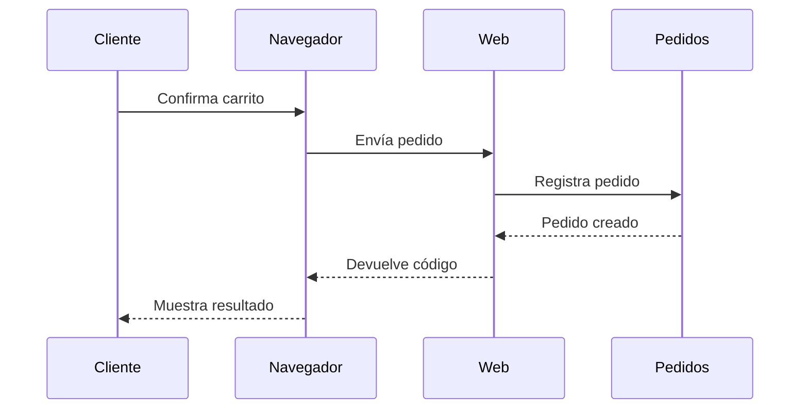
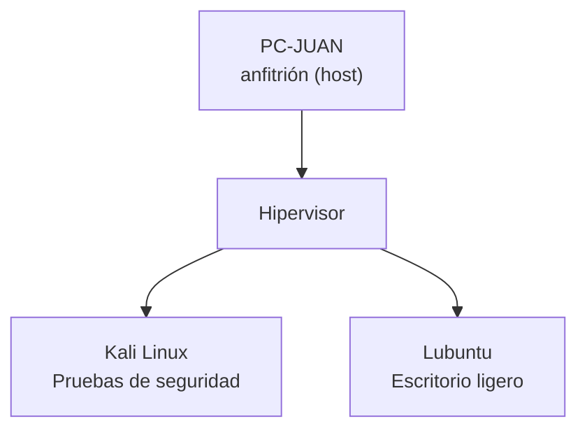

# Sesión 1: Sistemas operativos de red e introducción a la virtualización

## 1. Datos de la sesión

- **Unidad:** Sistemas operativos y virtualización de servicios
- **Semana:** 1
- **Duración:** 90 minutos
- **Modalidad:** Virtual en vivo

## 2. Logro

Al finalizar la sesión, el estudiante explica para qué sirve un sistema operativo de red, cómo un servicio atiende solicitudes y cómo un hipervisor reparte los recursos de un equipo entre varias máquinas virtuales.

## 3. Forma de trabajo

Cada bloque sigue esta secuencia:

**concepto breve → ejemplo realista preparado con IA → decisión de los estudiantes → conclusión**

La IA ayuda al docente a preparar **mini-sistemas web funcionales**. Cada uno debe sentirse como una aplicación real: tiene una interfaz completa para su propósito, datos coherentes, validaciones, cambios de estado y retroalimentación. Sin embargo, solo implementa el flujo necesario para demostrar un concepto de la sesión.

Cada mini-sistema se entrega como un único archivo HTML que los estudiantes pueden descargar y abrir directamente en su navegador. No requiere instalación, servidor ni dependencias externas. Los datos se conservan temporalmente con `localStorage`, que es el almacenamiento disponible en el navegador.

### Sistema utilizado durante la sesión

Se trabajará con un **sitio web de comercio electrónico (e-commerce)** para consultar productos, utilizar un carrito y registrar pedidos.

Es un sistema de tipo **cliente-servidor**:

- Visitantes, clientes, vendedores y administradores utilizan un navegador como cliente.
- Un servicio web recibe las solicitudes de la plataforma.
- Los visitantes consultan productos.
- Los clientes agregan productos al carrito y registran pedidos.
- Los vendedores administran productos, stock y estados de pedidos.
- Los administradores gestionan usuarios.

Los servicios se separarán en máquinas virtuales para estudiar cómo se organiza una solución virtualizada. El ejemplo representa una arquitectura educativa simplificada, no un sistema listo para producción.

Todos los mini-sistemas deben mantener el mismo criterio:

- Una interfaz de aplicación web realista y adaptable a computadoras y celulares.
- Fondo claro y tipografía legible.
- Una sola pantalla, sin navegación entre páginas.
- Una sola función principal.
- Datos iniciales realistas y consistentes entre todas las actividades.
- Validación de datos y mensajes claros de éxito o error.
- Un botón discreto para restablecer los datos de demostración.
- Sin secciones decorativas, estadísticas irrelevantes, animaciones ni funciones ajenas al concepto.

## 4. Guion de clase

### 4.1. Problema inicial - 5 minutos

Presentar el caso:

> Una pequeña tienda necesita implementar un sitio web de comercio electrónico. Los visitantes consultarán productos, los clientes utilizarán un carrito y registrarán pedidos, los vendedores actualizarán el stock y los administradores gestionarán usuarios. La tienda dispone de un solo servidor físico. ¿Cómo podría organizar la solución?

Los estudiantes escriben una primera propuesta en el chat. Todavía no se presenta la solución.

---

### 4.2. Sistema operativo de red - 14 minutos

#### Teoría - 7 minutos

Introducir en este orden:

- **Sistema operativo:** administra el hardware y permite ejecutar programas.
- **Red:** conjunto de equipos conectados que intercambian información.
- **Sistema operativo de red:** administra usuarios, recursos y comunicaciones entre equipos.
- **Usuario:** persona o proceso autorizado para utilizar el sistema operativo.
- **Grupo:** conjunto de usuarios que comparte permisos.
- **Permiso:** autorización para leer, modificar o ejecutar un recurso.
- **Recurso compartido:** archivo, carpeta o dispositivo disponible mediante la red.

#### Práctica con IA: ejecutar una política de acceso - 7 minutos

Cada estudiante abre el mini-sistema de administración de la plataforma. Cambia entre usuarios de demostración y observa cómo aparecen, se deshabilitan o se rechazan las acciones según el rol seleccionado.

```text
Cliente       → puede registrar /pedidos
Vendedor      → puede modificar /stock
Administrador → puede registrar /pedidos, modificar /stock y gestionar /usuarios
```

Los estudiantes responden:

1. ¿Qué ocurrirá si un cliente intenta registrar un pedido?
2. ¿Podrá un cliente modificar el stock de un producto?
3. ¿Qué riesgo produciría permitir que cualquier usuario gestione las cuentas?

Los estudiantes ejecutan los tres casos en sus equipos y revisan el resultado para identificar qué regla permitió o rechazó cada acción.

**Prompt para preparar el recurso:**

> Construye una pantalla web minimalista y funcional para demostrar autorización por roles en un e-commerce. Entrega un solo archivo HTML con CSS y JavaScript integrados, sin dependencias externas.
>
> Usa solamente tres roles: Cliente, Vendedor y Administrador. Incluye un selector de usuario, un selector de acción y un botón Ejecutar. Las acciones son Registrar pedido, Actualizar el stock y Gestionar usuarios. Cliente puede registrar pedidos; Vendedor puede actualizar el stock; Administrador puede realizar las tres acciones. Al ejecutar, muestra “Permitido” o “Rechazado” y la regla aplicada.
>
> Presenta todo en una sola tarjeta central, conserva únicamente el último resultado y añade un botón Restablecer. Mantén las reglas en una estructura JavaScript fácil de localizar. No incluyas menú, tabla, bitácora, login, contraseñas ni administración real. Debe funcionar al abrir el archivo directamente en el navegador.

**Conclusión:** el sistema operativo utiliza usuarios, grupos y permisos para controlar el acceso a los recursos.

---

### 4.3. Servicios de red - 14 minutos

#### Teoría - 6 minutos

Introducir primero:

**Servicio de red:** programa que recibe solicitudes de otros equipos y produce una respuesta.

Presentar ejemplos:

- **Servicio web:** entrega páginas o aplicaciones.
- **Servicio de nombres:** relaciona nombres con direcciones de red.
- **Servicio de configuración automática:** entrega la configuración de red a los equipos.
- **Servicio de archivos:** almacena y comparte documentos.
- **Servicio de acceso remoto:** permite administrar un equipo desde otra ubicación.

En el caso de estudio, el servicio web presenta el catálogo y un componente de pedidos valida el carrito y registra cada nuevo pedido.

#### Práctica con IA: ejecutar una solicitud de red - 8 minutos

Cada estudiante abre el mini e-commerce, consulta un producto, lo agrega al carrito y registra un pedido. Después despliega el recorrido técnico de la solicitud para observar qué componentes participaron:



Los estudiantes consultan un producto, intentan agregar una cantidad mayor que el stock y registran un pedido válido. Después identifican:

1. Quién inicia la acción.
2. Qué componente recibe la solicitud.
3. Qué respuesta regresa.

Luego explican por qué consultar un producto y registrar un pedido producen respuestas diferentes.

**Prompt para preparar el recurso:**

> Construye un mini e-commerce minimalista y funcional en un solo archivo HTML con CSS y JavaScript integrados, sin dependencias externas. Debe demostrar únicamente el flujo catálogo → carrito → pedido.
>
> Usa una sola pantalla con tres productos. Cada producto muestra nombre, precio, stock y botón Agregar. A la derecha, muestra un carrito compacto con productos, cantidad, total y botón Registrar pedido. Valida que no se supere el stock. Al registrar, descuenta el stock, vacía el carrito y muestra un código de pedido.
>
> Debajo del último resultado, incluye un enlace “Ver recorrido” que revele solamente: cliente → navegador → servicio web → pedidos → respuesta. Usa precios en soles, localStorage y un botón Restablecer. No incluyas detalle de producto, búsqueda, categorías, pagos, cuentas, envíos, promociones ni menú. Debe funcionar al abrir el archivo directamente en el navegador.

**Conclusión:** un servicio de red atiende una necesidad concreta mediante solicitudes y respuestas.

---

### 4.4. Fundamentos de virtualización - 18 minutos

#### Teoría - 8 minutos

Introducir en este orden:

- **Virtualización:** creación mediante software de una representación de un recurso tecnológico.
- **Equipo anfitrión (host):** computadora física que proporciona sus recursos.
- **Hipervisor:** software que crea y administra máquinas virtuales.
- **Máquina virtual:** computadora representada mediante software que recibe parte de los recursos físicos.
- **Sistema operativo invitado (guest):** sistema operativo instalado dentro de una máquina virtual.



#### Práctica con IA: asignar recursos a máquinas virtuales - 10 minutos

El equipo anfitrión (host) **PC-JUAN** dispone de:

- 8 GB de memoria.
- 4 núcleos de procesamiento.
- 100 GB de almacenamiento.

Cada estudiante abre una herramienta gráfica y distribuye los recursos del equipo entre las dos máquinas virtuales:

| Máquina virtual | Memoria | Procesamiento | Almacenamiento |
|---|---:|---:|---:|
| Kali Linux |  |  |  |
| Lubuntu |  |  |  |
| Recursos sin asignar |  |  |  |

El estudiante introduce las cantidades y presiona **Aplicar configuración**. La consola muestra los recursos utilizados, los disponibles y una advertencia si se supera un límite. Después corrige la distribución y vuelve a aplicarla.

**Prompt para preparar el recurso:**

> Construye una consola web minimalista para asignar recursos virtuales a un e-commerce. Entrega un solo archivo HTML con CSS y JavaScript integrados, sin dependencias externas.
>
> En una sola pantalla, muestra el equipo PC-JUAN con 8 GB de memoria, 4 núcleos y 100 GB de almacenamiento. Incluye una tabla de dos filas: Kali Linux para pruebas de seguridad, y Lubuntu como escritorio ligero. Permite editar memoria, núcleos y almacenamiento y aplicar la configuración. Muestra una barra por cada recurso con lo usado y disponible. Si se supera un límite, rechaza la configuración e indica cuál.
>
> Añade debajo un diagrama compacto: equipo físico → hipervisor → dos máquinas virtuales. Incluye localStorage y un botón Restablecer. No agregues inicio y detención, métricas, costos, monitoreo, recomendaciones, menú ni más máquinas. Debe funcionar al abrir el archivo directamente en el navegador.

**Conclusión:** las máquinas virtuales están separadas, pero comparten recursos físicos limitados.

---

### 4.5. Tipos de virtualización e hipervisores - 10 minutos

#### Teoría - 10 minutos

Presentar brevemente los tipos solicitados por el sílabo:

- **Virtualización de servidores:** permite ejecutar varias máquinas virtuales en un equipo físico.
- **Virtualización de escritorios:** permite utilizar un escritorio ejecutado en otra ubicación.
- **Virtualización de aplicaciones:** separa una aplicación del sistema operativo donde se utiliza.
- **Virtualización de almacenamiento:** presenta varios recursos de almacenamiento como una unidad lógica.
- **Virtualización de red:** representa componentes y conexiones de red mediante software.

Después, comparar:

| Hipervisor | Ubicación | Uso habitual |
|---|---|---|
| **Tipo 1** | Directamente sobre el equipo físico | Servidores empresariales |
| **Tipo 2** | Dentro de un sistema operativo | Aprendizaje y pruebas |

**Conclusión parcial:** el tipo de hipervisor se elige de acuerdo con el entorno en el que se ejecutará. La comparación completa y el diseño de la arquitectura se retoman en la sesión 2.

---

### 4.6. Cierre y tarea - 5 minutos

Cada estudiante anota, para traer a la sesión 2:

1. **Versión más reciente** de Windows Server, Ubuntu Server, Lubuntu, Red Hat Enterprise Linux y Kali Linux, con su fecha de publicación.
2. **Proveedores de servicios en la nube** que existan hoy y el nombre del servicio con el que cada uno ofrece máquinas virtuales (Google Cloud, AWS, Microsoft Azure, Oracle Cloud y cualquier otro que encuentren).

Debe registrarse el **enlace oficial** de donde se obtuvo cada dato: las versiones cambian con frecuencia y la fuente forma parte de la respuesta. La revisión abre la sesión 2.

## 5. Distribución del tiempo

| Momento | Duración |
|---|---:|
| Problema inicial | 5 minutos |
| Sistema operativo de red | 14 minutos |
| Servicios de red | 14 minutos |
| Fundamentos de virtualización | 18 minutos |
| Tipos de virtualización e introducción a los hipervisores | 10 minutos |
| Cierre y tarea | 5 minutos |
| **Suma de los bloques** | **66 minutos** |

Quedan 24 minutos de margen respecto de los 90 de la sesión. Sirven para ampliar las tres prácticas, que son la parte que más se alarga con estudiantes sin experiencia previa.

## 6. Evidencias

- Decisiones sobre usuarios, grupos y permisos.
- Explicación del recorrido de una solicitud web.
- Tabla de recursos de las máquinas virtuales.
- Tarea: versiones de sistemas operativos y proveedores de nube, con su fuente.

## 7. Preparación del docente

1. Generar los tres archivos HTML indicados en el guion.
2. Abrirlos sin servidor y comprobar que funcionen sin conexión a internet.
3. Compartirlos con los estudiantes antes de iniciar cada práctica.
4. Mantener nombres simples: `permisos.html`, `servicios.html` y `recursos-vm.html`.
5. Conservar capturas estáticas por si algún estudiante no puede ejecutar un archivo.

## 8. Alcance

Esta sesión llega hasta la introducción de los tipos de hipervisor. La comparación completa, el encaje con la nube y el reto de diseño se trabajan en la **sesión 2**. La creación de una máquina virtual GNU/Linux se realizará en las sesiones 3 y 4, como establece el sílabo.
