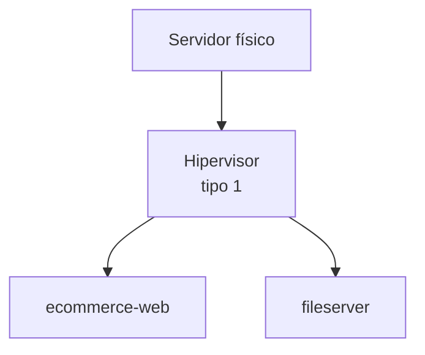
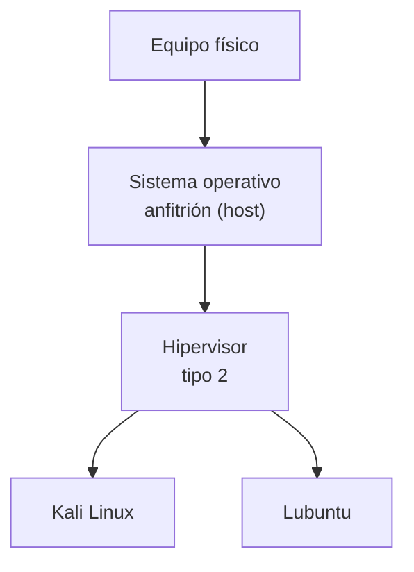

# Sesión 2: Tipos de hipervisor y diseño de una arquitectura virtualizada

## 1. Datos de la sesión

- **Unidad:** Sistemas operativos y virtualización de servicios
- **Semana:** 2
- **Duración:** 90 minutos
- **Modalidad:** Virtual en vivo

## 2. Logro

Al finalizar la sesión, el estudiante diferencia los hipervisores de tipo 1 y tipo 2 según el entorno y el propósito, y representa con un diagrama una solución sencilla basada en máquinas virtuales.

## 3. Punto de partida

La sesión 2 continúa el caso de la sesión 1: la tienda que debe funcionar sobre un solo servidor físico. Se retoman sin volver a explicarlos los conceptos de **sistema operativo de red**, **servicio de red**, **virtualización**, **anfitrión (host)**, **hipervisor**, **máquina virtual** y **sistema operativo invitado (guest)**.

No hay práctica con archivo HTML en esta sesión: el trabajo del estudiante es la comparación razonada y el diagrama final.

## 4. Guion de clase

### 4.1. Revisión de la tarea - 8 minutos

Se revisan las versiones de sistemas operativos y los proveedores de nube que cada estudiante averiguó, junto con la fuente. Sirve para dos cosas: comprobar que se consultaron sitios oficiales y conectar los nombres de proveedores con el bloque de hipervisores que viene a continuación.

### 4.2. Tipos de hipervisor - 15 minutos

Se repite la diapositiva de cierre de la sesión anterior para retomar el hilo:

| Hipervisor | Ubicación | Uso habitual |
|---|---|---|
| **Tipo 1** | Directamente sobre el equipo físico | Servidores empresariales |
| **Tipo 2** | Dentro de un sistema operativo | Aprendizaje y pruebas |

Las dos arquitecturas, lado a lado:

**Conclusión:** el tipo de hipervisor se elige de acuerdo con el entorno en el que se ejecutará.

---

Después se compara criterio por criterio (ubicación, entorno y propósito) y se cierra con lo que usan los proveedores de nube: todos ejecutan hipervisores de tipo 1 sobre el hardware — Google Cloud con KVM, AWS con Nitro (basado en KVM) y Microsoft Azure con Hyper-V.

### 4.3. Dónde encaja la nube - 7 minutos

Se traduce cada elemento estudiado a su equivalente en Google Cloud: el servidor físico son los centros de datos de Google, el hipervisor lo administra Google, las máquinas virtuales son instancias de Compute Engine, la asignación de recursos es el tipo de máquina, los usuarios y permisos son IAM, y los puertos abiertos son reglas de firewall de la red VPC.

### 4.6. Reto de diseño de sistemas - 17 minutos

Introducir el **diseño de sistemas** como la representación de los componentes de una solución y de las relaciones entre ellos.

#### Consigna

Dibujar la arquitectura mínima del e-commerce utilizando únicamente estos elementos:

- Cliente.
- Navegador.
- Servidor físico.
- Hipervisor.
- ecommerce-web: catálogo, carrito y pedidos.
- fileserver: comprobantes y backups.

El dibujo debe cumplir tres condiciones:

1. El hipervisor y las máquinas virtuales deben aparecer dentro del servidor físico.
2. El cliente debe llegar al e-commerce mediante el navegador.
3. Las flechas deben mostrar la dirección de la comunicación.

Los estudiantes pueden dibujarlo en papel, una pizarra digital o una herramienta de diagramación. No deben agregar bases de datos, servicios cloud, balanceadores ni otros componentes que todavía no se hayan estudiado.

**Distribución sugerida:** 3 minutos para observar los elementos, 10 minutos para dibujar y 4 minutos para comparar dos dibujos.

**Evidencia:** una fotografía, captura o archivo del dibujo terminado.

---

### 4.7. Cierre - 5 minutos

Cada estudiante completa en el chat:

- Un sistema operativo de red sirve para...
- Una máquina virtual necesita...
- Elegiría un hipervisor de tipo 1 cuando...

## 5. Distribución del tiempo

| Momento | Duración |
|---|---:|
| Revisión de la tarea | 8 minutos |
| Tipos de hipervisor | 15 minutos |
| Dónde encaja la nube | 7 minutos |
| Reto de diseño | 17 minutos |
| Cierre | 5 minutos |
| **Suma de los bloques** | **52 minutos** |

Quedan 38 minutos de margen respecto de los 90 de la sesión. El reto de diseño es el candidato natural para absorberlos: permite dibujar con calma y comparar más de dos trabajos.

## 6. Evidencias

- Tarea de la sesión 1 resuelta, con enlaces oficiales.
- Elección justificada del tipo de hipervisor.
- Diagrama final de la solución.

## 7. Preparación del docente

1. Tener a mano el diagrama de referencia de la solución.
2. Preparar una pizarra digital o un espacio donde comparar dos o tres dibujos de los estudiantes.
3. Revisar las respuestas de la tarea antes de la clase para saber qué proveedores mencionar.

## 8. Alcance

La sesión cierra la parte conceptual de la unidad. La creación de una máquina virtual GNU/Linux se realizará en las sesiones 3 y 4, como establece el sílabo.
