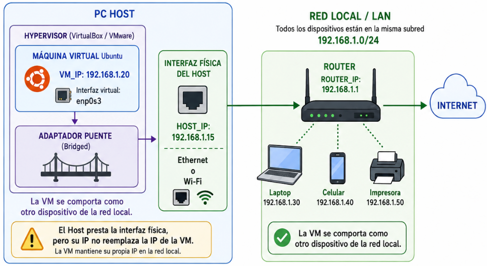
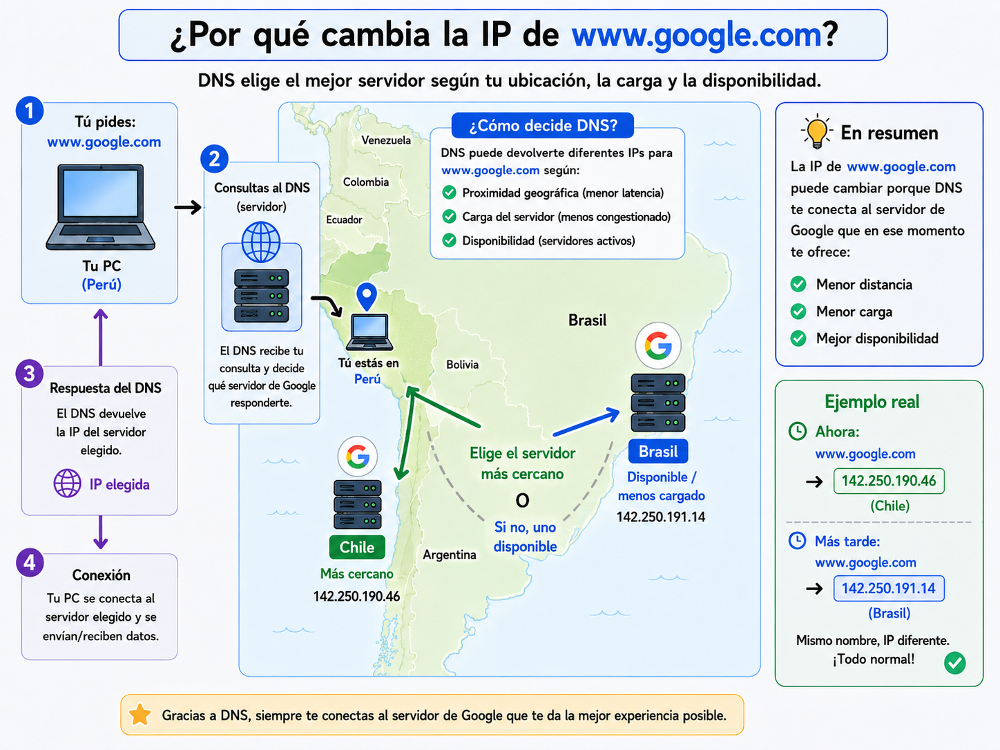
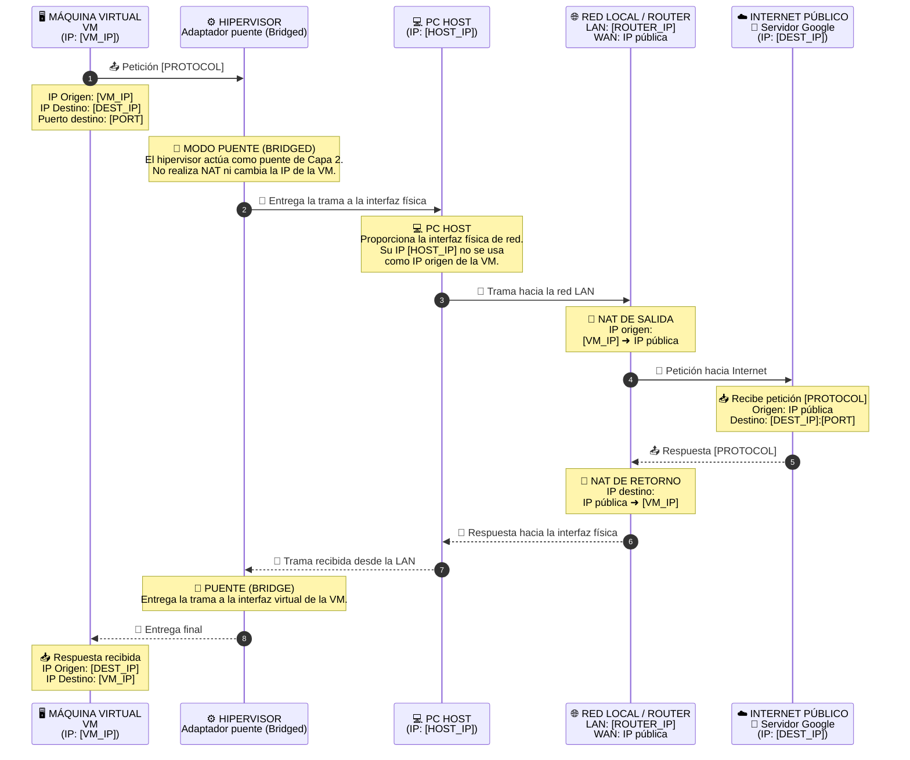
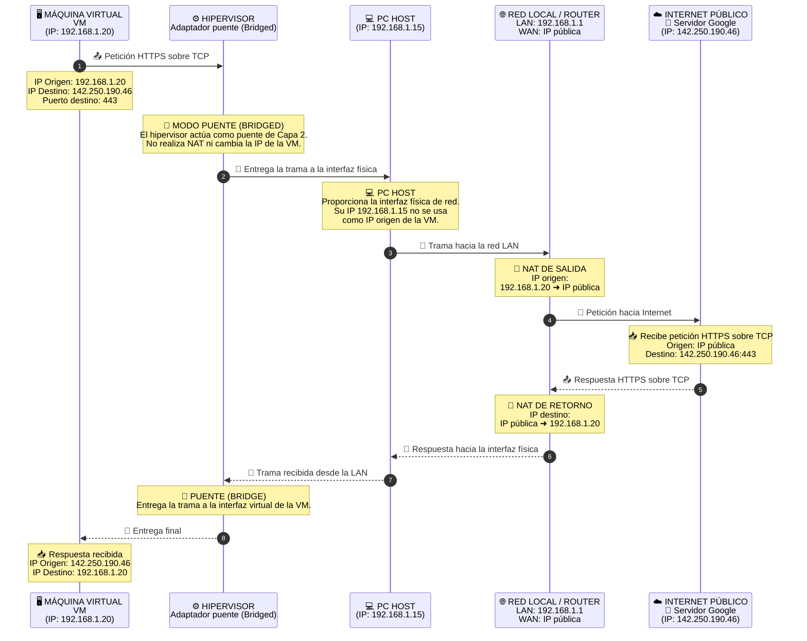
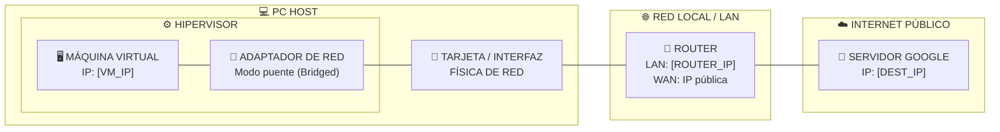
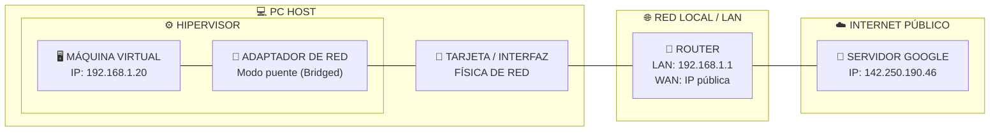

# Tarea: análisis del flujo de red de una máquina virtual hacia Internet

## Objetivo

En esta tarea analizarás cómo una máquina virtual con Ubuntu se conecta a un servidor de Internet cuando utiliza el modo de red **Adaptador puente (Bridged)**.

Al terminar, elaborarás un diagrama de secuencia y un diagrama de bloques que represente la arquitectura de red con los datos reales de tu equipo. Además, explicarás qué ocurre con el tráfico desde que sale de la máquina virtual hasta que recibe una respuesta.

## Datos que debes registrar

Registra los siguientes valores:

```text
VM_IP = [IP privada de la máquina virtual]
ROUTER_IP = [puerta de enlace predeterminada]
HOST_IP = [IP privada de la computadora física]
DEST_IP = [IP del servidor de destino]
PROTOCOL = [protocolo identificado]
PORT = [puerto identificado]
```

Para que todos trabajen con un caso similar, realiza una conexión HTTPS a:

```text
www.google.com
```

La dirección IP de Google puede variar. Debes usar la dirección que obtengas durante tu práctica, no la de los ejemplos.

## 1. Comprueba el modo de red de la máquina virtual

Antes de ejecutar los comandos, verifica que la máquina virtual esté configurada en modo puente.

En VirtualBox:

```text
Configuración de la VM → Red → Adaptador 1 → Adaptador puente
```

En VMware:

```text
VM Settings → Network Adapter → Bridged
```

Con el modo **Bridged**, la máquina virtual se conecta a la misma subred que la computadora física y recibe su propia dirección IP, como si fuera otro equipo de la red local. No debes seleccionar el modo **NAT**, porque representa un flujo de red diferente.



## 2. Obtén la IP de la máquina virtual

Abre una terminal dentro de Ubuntu y ejecuta:

```bash
ip addr
```

Obtendrás una salida parecida a esta:

```text
2: enp0s3: <BROADCAST,MULTICAST,UP,LOWER_UP>
    inet 192.168.1.20/24 brd 192.168.1.255 scope global enp0s3
```

Busca la interfaz de red activa, que puede llamarse `enp0s3`, `ens33` u otro nombre similar. Su dirección IPv4 aparece después de `inet`:

```text
VM_IP = 192.168.1.20
```

No uses la dirección `127.0.0.1`, porque pertenece a la interfaz local del sistema.

## 3. Obtén la IP del router

En la misma terminal de Ubuntu ejecuta:

```bash
ip route
```

Busca la línea que comienza con `default via`:

```text
default via 192.168.1.1 dev enp0s3
```

La dirección que aparece después de `default via` es la IP del router:

```text
ROUTER_IP = 192.168.1.1
```

## 4. Obtén la IP de la computadora física

Ejecuta el comando correspondiente en tu computadora física, fuera de la máquina virtual.

### Windows

Abre CMD o PowerShell y ejecuta:

```cmd
ipconfig
```

Busca la dirección IPv4 del adaptador Wi-Fi o Ethernet que utilizas para conectarte a la red.

### macOS

Abre Terminal y ejecuta:

```bash
ifconfig
```

Busca la interfaz activa, normalmente `en0` para Wi-Fi, y localiza su dirección `inet`.

### Ubuntu/Linux

Abre una terminal y ejecuta:

```bash
ip addr
```

Busca la dirección `inet` de la interfaz Wi-Fi o Ethernet activa.

No uses `127.0.0.1` ni una dirección de un adaptador virtual. Debes registrar la IP del adaptador Wi-Fi o Ethernet con el que tu computadora se conecta a la red.

```text
HOST_IP = [IP obtenida en la computadora física]
```

## 5. Comprueba que el Host y la VM pertenecen a la misma red

En modo puente, la computadora física y la máquina virtual funcionan como dos dispositivos diferentes dentro de la misma red local. Por ejemplo:

```text
ROUTER_IP = 192.168.1.1
HOST_IP   = 192.168.1.15
VM_IP     = 192.168.1.20
```

Las direcciones no tienen que coincidir con el ejemplo, pero normalmente compartirán el mismo prefijo de red. En la salida de `ip addr`, una dirección como `192.168.1.20/24` indica que la red es `192.168.1.0/24`.

Una **subred** es un grupo de dispositivos que comparten el mismo rango de direcciones IP. En este ejemplo, el Host, la VM y el router pertenecen a la subred `192.168.1.0/24`.

## 6. Obtén la IP del servidor de destino

Dentro de Ubuntu ejecuta:

```bash
ping www.google.com
```

Antes de iniciar la conexión, **DNS** traduce el nombre `www.google.com` a una dirección IP que la VM puede usar como destino.



La dirección IP aparece entre paréntesis en la primera línea. Después de verla, puedes detener el comando con `Ctrl+C`:

```text
PING www.google.com (142.250.190.46) 56(84) bytes of data.
```

Entonces registrarías:

```text
DEST_IP = 142.250.190.46
```

## 7. Comprueba la conexión HTTPS desde el navegador

Al ingresar `www.google.com` en la barra de direcciones del navegador, Firefox reconoce que el dominio está configurado para utilizar conexiones seguras y le asigna automáticamente HTTPS. HTTPS utiliza de manera estándar el puerto 443. En cambio, existen sitios como `httpforever.com` que sí permiten conexiones mediante HTTP.

Por lo tanto, para completar el diagrama debes registrar:

```text
PROTOCOL = HTTPS sobre TCP
PORT = 443
```

En esta práctica, HTTPS utiliza `TCP` como protocolo de transporte. Por eso debes expresarlo como `HTTPS sobre TCP` en tu diagrama.

## 8. Explica el flujo de red

En modo puente, la máquina virtual se comporta como otro dispositivo de la red local. El hipervisor permite que sus tramas utilicen la interfaz física, pero no sustituye la IP de la VM por la IP del Host.

Antes de llegar al router, la conexión conserva estos datos:

```text
Origen: VM_IP
Destino: DEST_IP
Puerto de destino: 443
```

Aunque la VM utiliza el modo puente y no el modo NAT del hipervisor, el router de la red sí realiza NAT para permitir la salida a Internet. Son dos funciones diferentes: el modo puente conecta la VM directamente a la red local y el router traduce la IP privada de la VM al comunicarse con Internet.

El router realiza la traducción de direcciones (NAT) al enviar el tráfico a Internet:

```text
Antes del NAT:
Origen = VM_IP
Destino = DEST_IP

Después del NAT:
Origen = IP pública
Destino = DEST_IP
```

**NAT (Network Address Translation)** permite que varios dispositivos de una red privada usen **una sola IP pública** para salir a Internet.

Ejemplo: la VM tiene `192.168.1.20`. Al entrar a una web, el router cambia esa IP privada por su IP pública. Cuando llega la respuesta, el router recuerda qué dispositivo hizo la petición y la devuelve a la VM.

En corto: **NAT traduce IPs privadas ↔ IP pública**.

La expresión **IP pública** aparece en el diagrama para representar la dirección que se observa desde Internet. Puedes obtenerla si deseas comprobarla, pero no debes agregarla a tus resultados.

La idea principal es la siguiente:

```text
Máquina virtual → Adaptador puente → Interfaz física del Host → Router → Internet
Internet → Router → Interfaz física del Host → Adaptador puente → Máquina virtual
```

La computadora física proporciona acceso a su interfaz de red, pero su dirección `HOST_IP` no reemplaza la dirección de la máquina virtual.

## 9. Completa tus resultados

Llena esta plantilla con los valores que obtuviste:

```text
VM_IP =
ROUTER_IP =
HOST_IP =
DEST_IP =
PROTOCOL =
PORT =
```

## 10. Elabora el diagrama de secuencia

### Plantilla sin completar

Primero copia esta plantilla. Los valores entre corchetes representan los datos que debes obtener durante la práctica:



### Ejemplo completado

El siguiente diagrama muestra cómo quedaría la plantilla después de reemplazar los campos con los valores usados en esta guía:



## 11. Elabora el diagrama de bloques de la arquitectura de red

Este diagrama muestra cómo se conectan la máquina virtual, el hipervisor, la interfaz física, el router y el servidor de Google.

### Plantilla sin completar

Reemplaza los campos entre corchetes con los valores que obtuviste:



### Ejemplo completado

Con los valores utilizados en esta guía, el diagrama quedaría así:



## Entrega

Tu entrega debe incluir:

1. El diagrama de secuencia con tus valores reales.
2. El diagrama de bloques de la arquitectura de red con tus valores reales.
